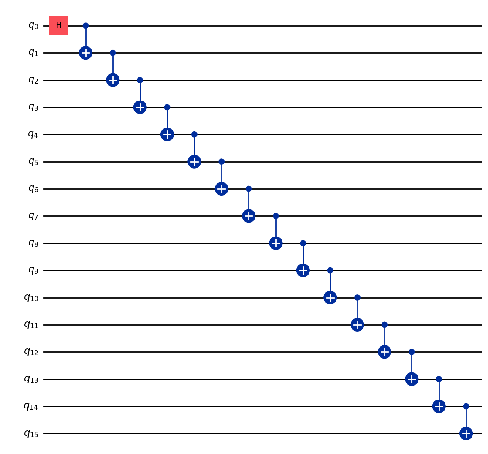
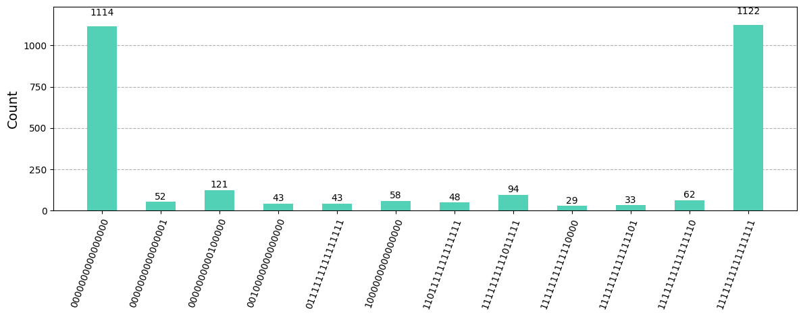
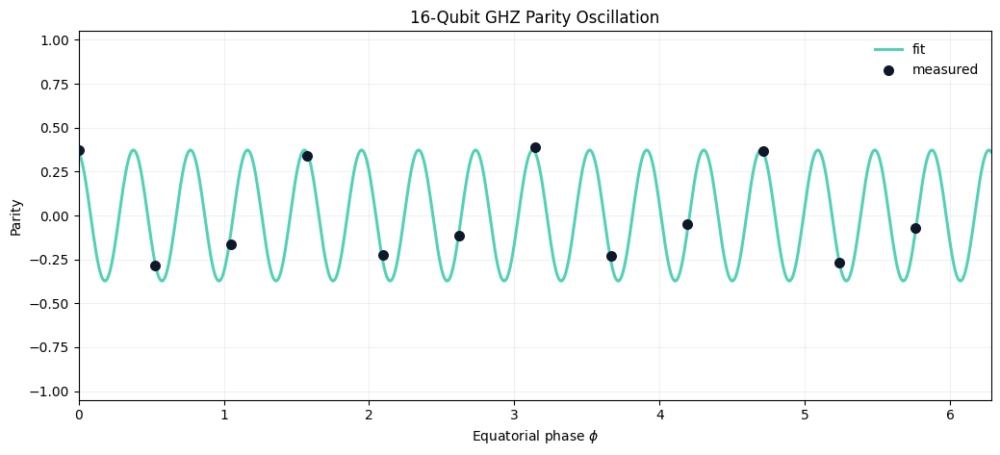

# GHZ-16 Entanglement Witness on IBM Quantum Hardware


This repository packages a real IBM Quantum hardware run of a fixed-layout GHZ witness experiment on `16` qubits. The workflow prepares a line-topology GHZ state, measures the GHZ populations in the computational basis, scans the equatorial-basis parity oscillation, and combines those observables into the lower-bound witness

`F_lb = (P + A) / 2`

where `P` is the GHZ population sum and `A` is the fitted parity amplitude.

The measured lower bound $F_{lb} = 0.459$ does not cross the $0.5$ witness threshold, so this repository presents the run as a hardware GHZ characterization result without the stronger certification claim.

## Current Hardware Result

| Field | Value |
| --- | --- |
| Backend | `ibm_kingston` |
| Job ID | `d7fhlpe2cugc739qj4j0` |
| Qubits | `16` |
| Physical chain | `69, 78, 89, 90, 91, 92, 93, 79, 73, 74, 75, 59, 55, 54, 53, 52` |
| `P(0...0)` | `0.2720` |
| `P(1...1)` | `0.2739` |
| `P = P0 + P1` | `0.5459` |
| Parity amplitude `A` | `0.3730` |
| Lower bound `F_lb` | `0.4594` |
| GME witness pass | `False` |
| Transpiled depth | `64` |
| Two-qubit gate count | `15` |

## Why This Witness Matters

The GHZ witness captures two distinct ingredients of a multipartite entangled state on real hardware:

- population concentrated in the `|0...0>` and `|1...1>` basis states
- coherent phase information that survives as a large parity oscillation in the equatorial basis

Taken together, these two observables separate a coherent GHZ state from a classical mixture of the same endpoint populations.





## Dominant Computational-Basis Outcomes

| Bitstring | Count | Probability |
| --- | ---: | ---: |
| `1111111111111111` | 1122 | 0.2739 |
| `0000000000000000` | 1114 | 0.2720 |
| `0000000000100000` | 121 | 0.0295 |
| `1111111111011111` | 94 | 0.0229 |
| `1111111111111110` | 62 | 0.0151 |
| `1000000000000000` | 58 | 0.0142 |
| `0000000000000001` | 52 | 0.0127 |
| `1101111111111111` | 48 | 0.0117 |

## Quick Start

```bash
python3 -m venv .venv
source .venv/bin/activate
pip install -r requirements.txt
python ghz_witness.py --mode local --qubits 16
```

Run on IBM Quantum hardware:

```bash
python ghz_witness.py --mode hardware --backend auto --qubits 16
```

Regenerate the repo docs after a new run:

```bash
python scripts/render_docs.py --result results/ghz16_witness_result.json --backend-comparison-result results/ghz16_witness_ibm_fez.json --stretch-result results/ghz20_witness_result.json
```

## Measurement Configuration

- Z-basis shots: `4096`
- Phase-circuit shots: `1024`
- Equatorial phases: `0.000, 0.524, 1.047, 1.571, 2.094, 2.618, 3.142, 3.665, 4.189, 4.712, 5.236, 5.760`
- Runtime resilience: dynamical decoupling, gate twirling, measurement twirling


## Backend Comparison

The repository also includes the same `16`-qubit witness workflow on a second Heron backend with a heavier shot budget:

| Field | Baseline | Comparison |
| --- | --- | --- |
| Backend | `ibm_kingston` | `ibm_fez` |
| Job ID | `d7fhlpe2cugc739qj4j0` | `d7fncb21u7fs739m7i7g` |
| Z-basis shots | `4096` | `8192` |
| Phase shots | `1024` | `2048` |
| `P` | `0.5459` | `0.3607` |
| `A` | `0.3730` | `0.2278` |
| `F_lb` | `0.4594` | `0.2943` |
| Witness pass | `False` | `False` |

The comparison run on `ibm_fez` came out `0.1652` lower in `F_lb` than the `ibm_kingston` baseline, which is useful evidence that backend choice dominated the outcome more than queue time.


## Stretch Attempt

The repository also includes a higher-qubit stretch run on `20` qubits from the same fixed-layout workflow:

| Field | Value |
| --- | --- |
| Backend | `ibm_kingston` |
| Job ID | `d7fhkmtd4lnc73ffc030` |
| `P` | `0.4172` |
| `A` | `0.2858` |
| `F_lb` | `0.3515` |
| Witness pass | `False` |

That stretch run captures the depth tradeoff directly: the same witness becomes harder to preserve as the GHZ chain gets longer on current hardware.


## Repository Layout

```text
.
├── README.md
├── LICENSE
├── Makefile
├── ghz_witness.py
├── requirements.txt
├── assets/
│   ├── ghz16_circuit.png
│   ├── ghz16_parity_fit.png
│   ├── ghz16_population_histogram.png
│   └── repo_preview.png
├── docs/
│   ├── hardware_run.md
│   └── method.md
├── results/
│   ├── ghz16_witness_result.json
│   ├── ghz16_witness_ibm_fez.json
│   ├── ghz20_witness_result.json
│   └── ghz20_witness_local.json
└── scripts/
    └── render_docs.py
```

## Further Reading

- [Method note](docs/method.md)
- [Hardware run note](docs/hardware_run.md)
