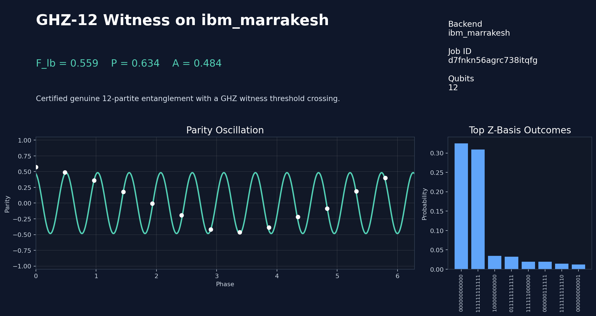
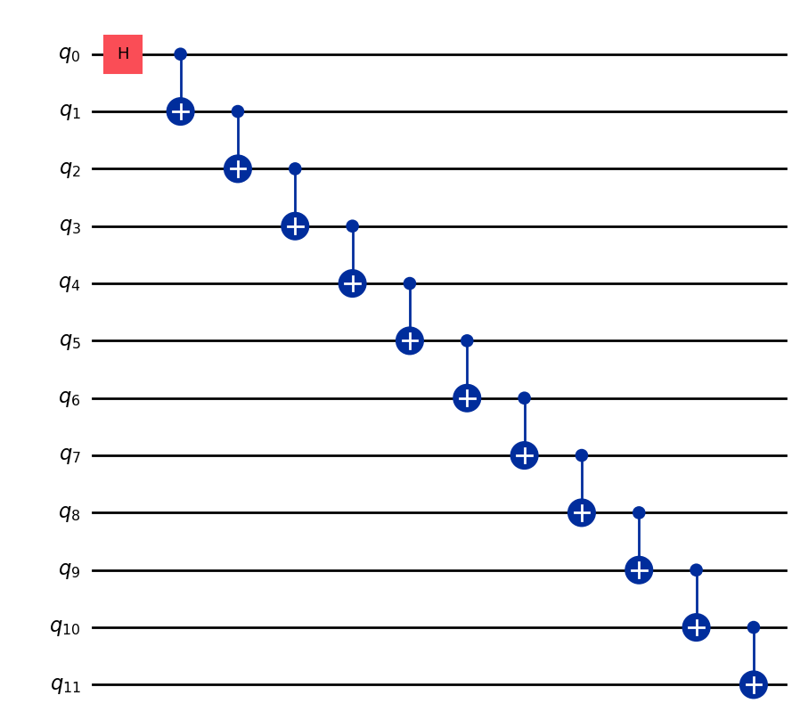
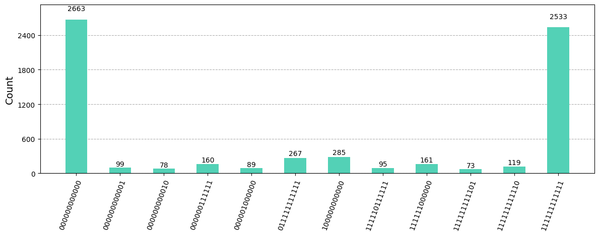
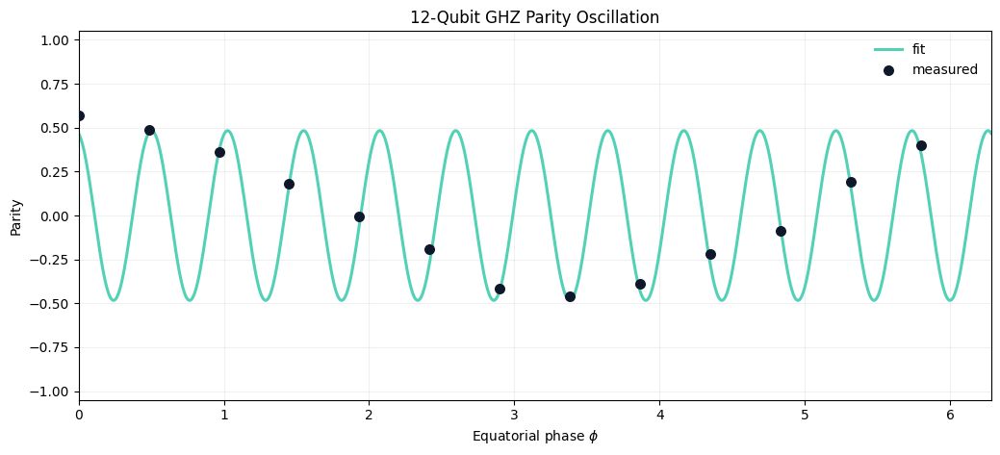

# Certified GHZ-12 Entanglement Witness on IBM Quantum Hardware



This repository packages a real IBM Quantum hardware run of a fixed-layout GHZ witness experiment on `12` qubits. The workflow prepares a line-topology GHZ state, measures the GHZ populations in the computational basis, scans the equatorial-basis parity oscillation, and combines those observables into the lower-bound witness

`F_lb = (P + A) / 2`

where `P` is the GHZ population sum and `A` is the fitted parity amplitude.

The measured lower bound $F_{lb} = 0.559$ exceeds the multipartite entanglement threshold of $0.5$, so this run certifies genuine 12-partite entanglement for the GHZ witness used here.

Alongside the certified run, the repository includes larger hardware attempts on the same GHZ witness to show the scaling limit directly from measured data.

This certified run uses `13` evenly spaced phase points so the parity fit resolves the GHZ oscillation without aliasing.

## Certified Hardware Result

| Field | Value |
| --- | --- |
| Backend | `ibm_marrakesh` |
| Job ID | `d7fnkn56agrc738itqfg` |
| Qubits | `12` |
| Physical chain | `31, 18, 11, 12, 13, 14, 15, 19, 35, 34, 33, 39` |
| `P(0...0)` | `0.3251` |
| `P(1...1)` | `0.3092` |
| `P = P0 + P1` | `0.6343` |
| Parity amplitude `A` | `0.4836` |
| Lower bound `F_lb` | `0.5590` |
| GME witness pass | `True` |
| Transpiled depth | `48` |
| Two-qubit gate count | `11` |

## Why This Witness Matters

The GHZ witness captures two distinct ingredients of a multipartite entangled state on real hardware:

- population concentrated in the `|0...0>` and `|1...1>` basis states
- coherent phase information that survives as a large parity oscillation in the equatorial basis

Taken together, these two observables separate a coherent GHZ state from a classical mixture of the same endpoint populations.





## Dominant Computational-Basis Outcomes

| Bitstring | Count | Probability |
| --- | ---: | ---: |
| `000000000000` | 2663 | 0.3251 |
| `111111111111` | 2533 | 0.3092 |
| `100000000000` | 285 | 0.0348 |
| `011111111111` | 267 | 0.0326 |
| `111111000000` | 161 | 0.0197 |
| `000000111111` | 160 | 0.0195 |
| `111111111110` | 119 | 0.0145 |
| `000000000001` | 99 | 0.0121 |

## Quick Start

```bash
python3 -m venv .venv
source .venv/bin/activate
pip install -r requirements.txt
python ghz_witness.py --mode local --qubits 12 --phase-points 13
```

Run on IBM Quantum hardware:

```bash
python ghz_witness.py --mode hardware --backend ibm_marrakesh --qubits 12 --phase-points 13 --shots-z 8192 --shots-phase 2048
```

Regenerate the repo docs after a new run:

```bash
python scripts/render_docs.py --result results/ghz12_witness_marrakesh_phase13.json --comparison-results results/ghz16_witness_result.json,results/ghz16_witness_ibm_fez.json,results/ghz20_witness_result.json
```

## Measurement Configuration

- Z-basis shots: `8192`
- Phase-circuit shots: `2048`
- Equatorial phases: `0.000, 0.483, 0.967, 1.450, 1.933, 2.417, 2.900, 3.383, 3.867, 4.350, 4.833, 5.317, 5.800`
- Runtime resilience: dynamical decoupling, gate twirling, measurement twirling


## Scaling Runs

The repository also checks in larger-chain hardware runs from the same witness workflow so the scaling tradeoff is visible in the data rather than implied:

| Qubits | Backend | Job ID | `P` | `A` | `F_lb` | Witness pass |
| --- | --- | --- | ---: | ---: | ---: | --- |
| `16` | `ibm_kingston` | `d7fhlpe2cugc739qj4j0` | `0.5459` | `0.3730` | `0.4594` | `False` |
| `16` | `ibm_fez` | `d7fncb21u7fs739m7i7g` | `0.3607` | `0.2278` | `0.2943` | `False` |
| `20` | `ibm_kingston` | `d7fhkmtd4lnc73ffc030` | `0.4172` | `0.2858` | `0.3515` | `False` |

The pattern is the main point: the `12`-qubit Marrakesh run clears the witness threshold, while the longer `16`- and `20`-qubit hardware attempts show how quickly parity coherence degrades as the GHZ chain gets deeper.


## Repository Layout

```text
.
├── README.md
├── LICENSE
├── Makefile
├── ghz_witness.py
├── requirements.txt
├── assets/
│   ├── ghz12_marrakesh_phase13_circuit.png
│   ├── ghz12_marrakesh_phase13_parity_fit.png
│   ├── ghz12_marrakesh_phase13_population_histogram.png
│   └── repo_preview.png
├── docs/
│   ├── hardware_run.md
│   └── method.md
├── results/
│   ├── ghz12_witness_marrakesh_phase13.json
│   ├── ghz16_witness_result.json
│   ├── ghz16_witness_ibm_fez.json
│   └── ghz20_witness_result.json
└── scripts/
    └── render_docs.py
```

## Further Reading

- [Method note](docs/method.md)
- [Hardware run note](docs/hardware_run.md)
